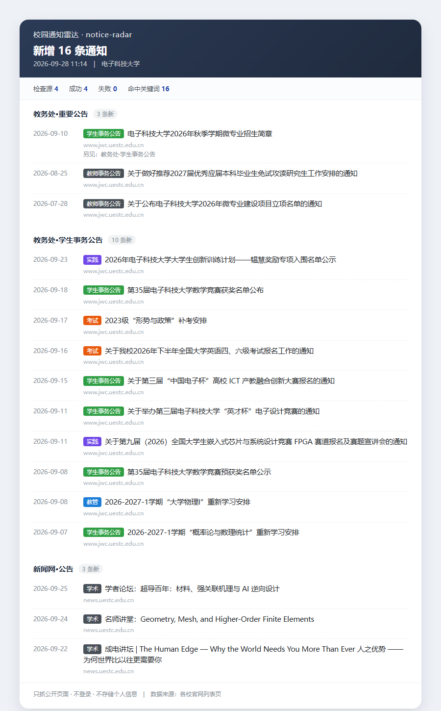
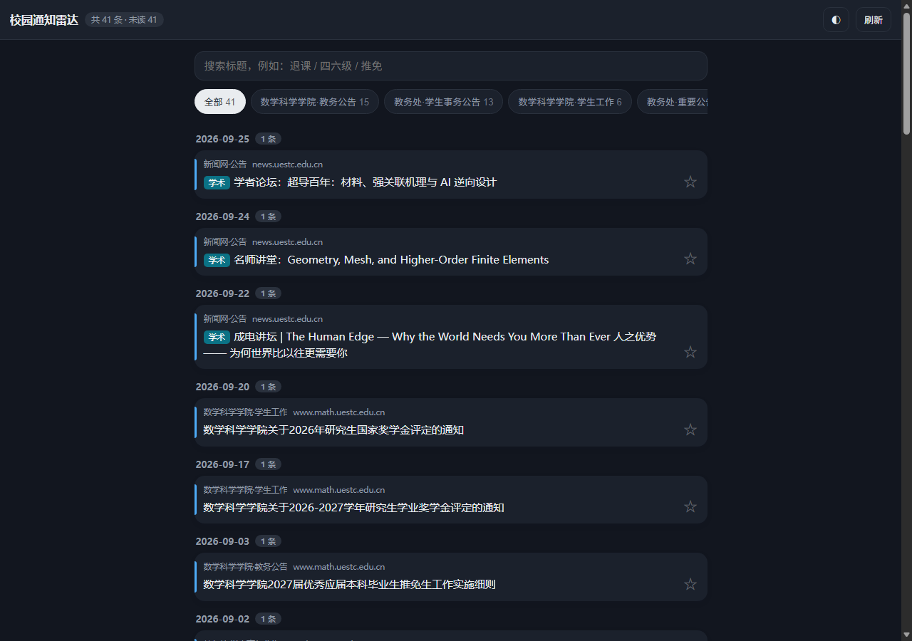
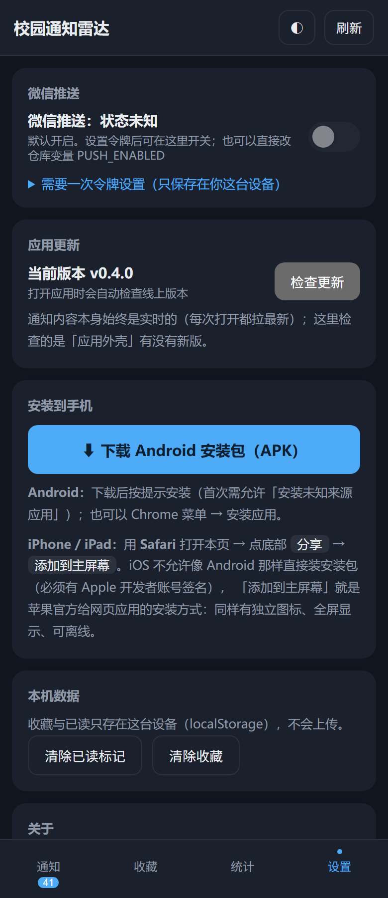
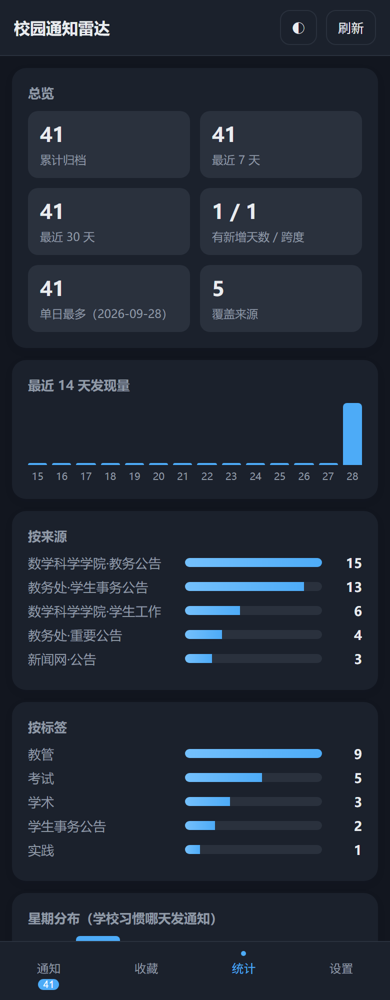

<div align="center">

# 校园通知雷达 · notice-radar

**把"没有 RSS、还被 WAF 挡着"的高校官网通知，变成可订阅、可关键词过滤、能推到手机的信息流。**

配置驱动 · 零服务器 · 不登录 · 任何学校 5 分钟接入

[](https://github.com/Yang-Yin734/notice-radar/actions/workflows/ci.yml)
[](https://github.com/Yang-Yin734/notice-radar/actions/workflows/android.yml)
[](LICENSE)
[](package.json)
[](CHANGELOG.md)

### 📲 [**下载 Android 安装包（APK）**](https://github.com/Yang-Yin734/notice-radar/releases/download/android-latest/notice-radar.apk)

装到手机上就是独立应用；也可以直接用网页版 → **<https://yang-yin734.github.io/notice-radar/>**

</div>

---

## 两种用法，选一个

| | 怎么用 | 适合 |
|---|---|---|
| **下载 APK（独立应用）** | [点这里下载](https://github.com/Yang-Yin734/notice-radar/releases/download/android-latest/notice-radar.apk) → 手机上安装。首次会提示"允许安装未知来源应用" | 想把它当成一个正常 App：桌面图标、**打开不需要联网**、没有地址栏、不跳浏览器 |
| **直接用网页** | 打开 <https://yang-yin734.github.io/notice-radar/>，可"添加到主屏幕" | 不想装东西，或者用 iPhone |

> **APK 是纯原生应用**（Kotlin + Jetpack Compose 写的界面，不是网页壳）：
> - 界面与数据都打包在 APK 内（`android/app/src/main/assets/data`，约 18 KB），**打开零网络、断网可用**
> - 没有 WebView、没有地址栏、不跳浏览器；外部链接才交给系统浏览器
> - 打开时先读内置数据，联网时按镜像顺序刷新：**jsDelivr → Statically → githack → GitHub Pages**（垫底），
>   因为 `github.io` 在国内经常打不开；抓到的新数据存在本机
> - **应用内不会出现"安装到手机"的引导**（那只对网页版访客有意义）；网页版才有那个横幅
> - 系统栏内边距用 Compose 的 `Scaffold`/`WindowInsets` 正确处理，窗口底色跟随应用主题（含深色），
>   不会出现底部白条
> - 由 [android.yml](.github/workflows/android.yml) 在 GitHub 上构建（Gradle + apksigner，不用 bubblewrap）；
>   同一把密钥才能覆盖安装，包名与旧版一致，可直接升级
>   （密钥生成见 [`tools/make-android-keystore.mjs`](tools/make-android-keystore.mjs)）

---

## 解决什么问题

学校通知散在教务处、学院、研究生院、新闻网十几个栏目里，而且：

1. **没有 RSS。** 想订阅只能自己写爬虫。
2. **有反爬。** 常见的是瑞数类 JS 挑战 WAF：非浏览器请求直接返回 `202` + 一个 2 KB 的挑战页。
3. **错过的代价很大。** 退课补选、重新学习报名、缓补考安排、推免名单、四六级报名——每条都有窗口期。

实测（2026-09-27，本机直连）：

| 源 | 结果 | 能否解析 |
|---|---|---|
| 教务处（重要公告 / 学生事务） | 200 / 25–29 KB | ✅ |
| 新闻网（公告 / 学术） | 200 / 86 KB | ✅ |
| 研究生院（通知） | 200 / 32 KB，含 JS 挑战脚本 | ⚠️ 时好时坏 |
| 学院官网（数学科学学院等） | **202 / 2.4 KB 挑战页**（无头浏览器会被回 400） | 🖥 用可见浏览器渲染，见「已支持」 |
| 公共 RSSHub | 10.5 s 超时 | ❌ 境内基本不可用 |

## 日报长什么样

`radr run` 的输出就是一条可以直接推到微信的 Markdown 消息（下面这张图由真实抓取结果渲染，生成脚本见 `tools/render-preview.mjs`）：



## 30 秒上手

需要 Node ≥ 22.18（利用 Node 原生的 TypeScript 支持，仓库里跑无需编译步骤）。

**只想试试看**（不用 clone）：

```bash
# 方式一：从 Release 装（现在就能用，不需要 npm 账号；已实测）
npm i -g https://github.com/Yang-Yin734/notice-radar/releases/download/v0.6.0/notice-radar-0.6.0.tgz

# 方式二：从 npm 装（包已就绪，等仓库配上 NPM_TOKEN 后即可发布，见 docs/publish.md）
npx notice-radar schools
```

装好后可用两个命令名（`notice-radar` 与 `radr`）：

```bash
notice-radar list       # 看内置的学校预设
notice-radar schools    # 适配器市场：谁维护哪个学校
notice-radar doctor     # 体检：每个源能不能抓、解析出几条
notice-radar stats      # 归档频次统计（来源/标签/周/星期分布）
```

> - 包发的是**编译后的 JS**：Node 不允许对 `node_modules` 里的文件做类型剥离，否则 `npx` 直接报
>   `ERR_UNSUPPORTED_NODE_MODULES_TYPE_STRIPPING`。细节见 [docs/publish.md](docs/publish.md)。
> - `npm i -g github:Yang-Yin734/notice-radar`（从 git 直装）在 **Windows 上不可靠**——npm 的
>   git 依赖准备阶段会因 `EPERM` 清理失败导致构建缺 typescript，已实测；Linux/macOS 上没有这个问题。

**要改配置、加自己学校**（推荐 clone）：

```bash
git clone https://github.com/Yang-Yin734/notice-radar.git
cd notice-radar
npm install

npm run doctor          # 先体检：每个源能不能抓、解析出几条
npm run run -- --dry    # 干跑：打印日报，不写状态、不推送

# 真推送到微信（Server酱 SendKey 从 https://sct.ftqq.com 拿）
SERVERCHAN_KEY=SCTxxxxxxxx npm run run
```

Linux/macOS 用 `SERVERCHAN_KEY=... npm run run`，Windows PowerShell 用 `$env:SERVERCHAN_KEY="..."; npm run run`；也可以复制 `.env.example` 为 `.env` 填好 —— CLI 会自动加载它（用 Node 原生能力，不依赖 dotenv）。

## 命令

| 命令 | 作用 |
|---|---|
| `radr doctor` | 体检：逐源显示状态码、体积、耗时、解析条目数 + **近 N 次记录**（成功/失败构成，用来发现不稳定的源），一眼看出是"站点变了"还是"选择器过时了" |
| `radr run` | 抓取 → 解析 → 关键词过滤 → 去重 → 出日报 → 推送 → 更新状态 |
| `radr doctor --only=jwc-student` | 只体检指定源（调试时不用等其它源的间隔）；`--only` 逗号可多选 |
| `radr list` | 列出配置里的源与关键词数量 |
| `radr --version` | 打印版本 |
| `radr run --dry` | 不写状态、不推送（调试用） |
| `radr run --no-notify` | 只出日报不推送 |
| `radr run --json=data/latest.json` | 同时导出结构化 JSON，方便二次开发 |
| `radr run --write-always` | 即使没有新通知也写状态与产物（默认只在有新通知时写） |
| `radr run --allow-browser` | 允许抓「需要浏览器渲染」的源（学院站点会短暂弹出浏览器窗口，几秒后自动关闭） |
| `radr fetch <url> [--window] [--out=文件]` | 用浏览器渲染任意页面并导出 DOM —— 给 WAF 站点写选择器时用它 |
| `radr dashboard` | 把历史归档渲染成静态仪表盘（`docs/index.html`，GitHub Pages 用） |
| `radr test-notify` | 只发一条测试消息，验证推送密钥配好没有 |
| `radr stats [--json=文件]` | 通知频次统计：来源/标签/最近 12 周/星期分布/单日最多 |
| `radr digest [--date=YYYY-MM-DD \| --hours=24] [--notify]` | 每日日报：把一天的新通知合成**一条**消息。**默认只预览不发送**，加 `--notify` 才真发；空窗口默认不打扰（`--force` 可强发） |
| `radr schools [--json=文件]` | 适配器市场：列出已知学校预设与维护者 |
| `radr tiers [--days=14] [--json=文件]` | 查看关键词分档：哪些会立刻推、哪些进日报（调关键词时用） |
| `radr health [--json=文件] [--notify]` | 抓取健康检查：哪些源长期没动静（只读归档，不联网） |

### 源配置里还能写什么

```yaml
sources:
  - id: jwc-important
    name: 教务处·重要公告
    url: https://www.jwc.uestc.edu.cn/hard/?page=1
    adapter: uestc/jwc
    pages: 2          # 抓前两页（缺省 1）；URL 里写 {page} 可自定义参数名，翻页之间有间隔
    include: [选课, 退课]   # 命中才要
    exclude: [招标, 中标]   # 命中就丢
    silenceDays: 30   # 这个源多久没动静才怀疑它挂了（覆盖全局 alerts.silenceDays）
```

### 推送分级与每日日报

通知分两种：**错过就麻烦的**（退课/选课/缓补考/推免/奖学金…）和**晚一天看也没关系的**（讲座/论坛/公示）。
以前全都即时推，期中期末手机上会很吵。现在的分工是：

| 档位 | 什么时候推 | 由谁决定 |
|---|---|---|
| ⚡ **立刻推** | 命中 `push.urgent` 关键词（标题或标签） | `poll.yml` / `poll-math.yml` 每 20 分钟一轮 |
| 📋 **进日报** | 其余全部，每天早上 8:00 汇总成**一条** | [daily-digest.yml](.github/workflows/daily-digest.yml)（00:05 UTC） |
| 🔇 **静音** | 命中 `push.mute`，既不时推也不进日报（仍留在应用/仪表盘里） | 配置 |
| — | 那天完全没有新通知 → **不发** | 空日报默认不打扰 |

想恢复「所有新通知都即时推」的老行为：把配置里的 `push.digestRest` 改成 `false`。

```bash
radr tiers --days=30              # 看看当前词表会把归档里的通知怎么分档（调词表必用）
radr digest                       # 预览：昨天（北京时间）的日报，只打印不发送
radr digest --date=2026-09-28     # 指定某一天
radr digest --hours=24            # 滚动 24 小时
radr digest --out=digest.md       # 同时落盘
radr digest --notify              # 真发（走配置里的推送通道）
node tools/digest-preview.mjs     # 生成"在微信里长什么样"的预览页（可截图看效果）
```

> 一天的判定用**我们首次发现它的时间**（`firstSeenAt`），不是通知自身的日期 —— 那才代表"对你来说是新的"。
> 日报窗口按**北京时间**（UTC+8）算自然日；标题裁到 Server酱 的 32 字上限内。

### 抓取健康告警

最阴险的失败模式是**静默失效**：你以为一直在收通知，其实某个源两周前就抓挂了。所以：

| 信号 | 反应 |
|---|---|
| 某个源**连续** `alerts.failureStreak` 次（默认 3 ≈ 1 小时）抓取失败，或抓到了却解析出 0 条 | **推一条微信告警**（同一个源 `alerts.throttleHours` 小时内只报一次） |
| 该源**历史成功率低于 70%**（例如学校 WAF 只放行国内 IP） | 阈值**自动放宽到至少 6**（≈2 小时），免得反复打扰你；也可在源上写 `failureStreak: 8` 自己定 |
| 某个源写了 `alertOnFailure: false` | 完全不为它发故障告警（日报里的静默提示仍会兜底） |
| **所有**源都以网络层错误一起失败（`fetch failed` / 超时 / DNS）= 网络天气 | **不按故障告警**，只在连续 `alerts.weatherStreak` 次（默认 12 ≈ **4 小时**）时才提醒一次 |
| 单次失败，或同一轮里的重试 | **不告警**（poll 一轮最多重试 6 次，这些尝试合并成一次失败） |
| 某源连续 `alerts.silenceDays` 天（默认 14）没有新通知 | **日报顶部**提示，不当急事推 |
| 某源从观察开始就没抓到过任何条目 | 同样在日报顶部提示（观察期不足 `warmupDays` 天不下结论） |

> **为什么要分"网络天气"**：GitHub runner 在境外，抓国内学校站点偶发整体不可达（实测约 1/3 的运行有影响）。
> 这时**不是你的源坏了**，而且你什么也做不了 —— 所以只在持续 4 小时以上才提醒一次。
> 但**只有全部源都连不上**才算天气：如果 5 个源里只挂 1 个，那正是需要提醒你的情况，照常告警。
>
> **个别源长期不稳怎么办**（实测：研究生院站点对境外 IP 更严，云端成功率仅 35~40%，本机国内实测 200/20 条）：
> 它的阈值会自动放宽（成功率 <70% → 至少 6 次），也可以在源上显式写 `failureStreak: 8`
> 或 `alertOnFailure: false`。**根本解法是让抓取在国内跑** —— 见「完全不用 GitHub：在本机（或国内机器）跑」一节。

**通知会丢吗？不会。** 全部源失败时状态文件不会被改动，所以下一轮成功时会把这些通知当作新增照常补发 ——
代价只是晚到（最多等到下一次成功，通常几分钟到 20 分钟）。

```bash
radr health                       # 手动查：哪些源长期没动静（只读归档，不联网）
radr doctor --only=jwc-important  # 单独体检某个源（是站点变了还是网络问题）
node tools/alert-scenario-check.mjs   # 自检两条告警路径（网络天气 vs 单源真坏）
```

告警结果留痕可查：`data/alerts.json`（谁在什么时候告警过）、`data/runs.json`（每个源最近 20 次记录）。

**嫌吵或想调**：`alerts.failureNotify: false` 关掉故障告警；`alerts.failureStreak: 6` 改成"约 2 小时都不通才提醒"；
某个源本来就更新慢（假期栏目）可以单独给它写 `silenceDays`。

> 「需要浏览器渲染」的源在云端被跳过（`skipped`）**不算故障**，不会误报。
> 寒暑假本来就安静，所以静默提示只是"值得跑一次 `radr doctor` 确认"，不会替你下结论。

## 已支持

| 学校 | 源 | 适配器 | 状态 |
|---|---|---|---|
| 电子科技大学 | 教务处·重要公告 | `uestc/jwc` | ✅ 实测可解析 |
| 电子科技大学 | 教务处·学生事务公告 | `uestc/jwc` | ✅ 实测可解析 |
| 电子科技大学 | 新闻网·公告 | `html-list`（通用） | ✅ 实测可解析 |
| 电子科技大学 | 研究生院·通知 | `uestc/gr` | ⚠️ 站点带 WAF，偶发失败 |
| 电子科技大学 | 数学科学学院·教务公告 | `html-list` + 浏览器 | ✅ 云端每天 08:00 + 本机兜底 |
| 电子科技大学 | 数学科学学院·学生工作 | `html-list` + 浏览器 | ✅ 云端每天 08:00 + 本机兜底 |

想加自己学校？看 **[docs/add-your-school.md](docs/add-your-school.md)** —— 大多数站点只要写一段 YAML。

### 🖥 学院级站点：为什么要"真实浏览器"

数学科学学院官网部署了瑞数（RiverSecurity）类 JS 机器人挑战，实测：

| 访问方式 | 结果 |
|---|---|
| 普通 HTTP 请求（Node fetch） | `202` + 2.4 KB 挑战页 |
| 带上挑战页下发的 Cookie 重放 | 仍是 `202` |
| **无头浏览器（headless Chrome/Edge）** | **`400 Bad Request`** —— 它认得出无头 |
| **真实浏览器窗口** | ✅ 正常渲染，拿到完整通知列表 |

所以这两个源用 `browserHeadless: false` 渲染，**两处都能跑**：

| 运行位置 | 怎么跑 | 时间 |
|---|---|---|
| GitHub Actions | `poll-math.yml`：给 runner 挂虚拟显示器（Xvfb）跑真实（非无头）Chrome | **每天北京 08:00** |
| 你的电脑 | `tools/run-daily.ps1`（计划任务）| **每天 09:00**，兜底补漏 |

**为什么云端能跑**：不是伪造 UA、也没有隐藏 `navigator.webdriver`——就是启动一个**真的、非无头的** Chrome，只不过它的"屏幕"是 Xvfb 提供的虚拟显示器。站点拒绝的是"无头"这个特征，而这里根本没有无头。

**为什么一天只跑一次**：这类站点部署机器人挑战是为了挡爬虫。我们每天只去看一次最新通知，且单源串行、带间隔；不跟着 `poll` 每 20 分钟打。这也是为什么它单独一个 workflow 而不是塞进 `poll`。

> 如果你的学校站点连真实浏览器都不放行（换了更强的检测），那就只能靠本机跑 + 班级群兜底了 —— 本项目不接受为了让脚本通过而去逆向挑战算法或伪造指纹的 PR。

## 本机每天自动跑（云端之外的兜底）

学院通知云端已经在 08:00 抓了，本机这个任务排在 **09:00**，作用是**兜底**：云端那轮挂了（网络抖动、或没配 secret）时，它补上。

| 文件 | 作用 |
|---|---|
| `tools/run-daily.ps1` | 计划任务入口：同步状态 → 抓取 → 写日志 → 提交状态 |
| `config/schools/uestc.yaml` | 全量预设（6 个源，含学院）—— 同步成功时用它 |
| `config/schools/uestc-math.yaml` | 只含学院两个源 —— 同步失败时的降级预设 |

**它每天怎么决策**（这一步是关键，直接决定你会不会收到重复推送）：

```
git pull 同步云端状态 ──成功──► 跑全部 6 个源（本地状态与云端一致，不会重复推）
        │
        └──失败（代理没开）──► 只跑学院 2 个源（仍不会与云端重复推）
```

本地和云端各记一份"已见通知"状态，所以**不同步就跑全量 = 同一条通知推两次**。降级成"只跑学院"就避开了这个陷阱。

> 如果你根本不想开电脑也照收通知，那这个任务可以删掉（云端 08:00 已经覆盖学院）：
> `Unregister-ScheduledTask -TaskName 'notice-radar-daily' -Confirm:$false`

## 完全不用 GitHub：在本机（或国内机器）跑

**先说结论：推送本来就不经过 GitHub。** 整条链路是 `radr run` → Server酱 → 微信，
GitHub Actions 只是"帮你定时执行 `radr run`"的免费 runner。所以把它换到任何一台机器上都行：

| 跑在哪 | 成本 | 抓国内站点 | 要不要一直开机 |
|---|---|---|---|
| **自己的电脑**（Windows 计划任务） | 0 | ✓ 直连，没有跨境抖动 | 是（开机才推） |
| **国内小服务器**（轻量云 ~¥10/月） | 低 | ✓✓ 最稳 | 不用 |
| **NAS / 树莓派 / 旧手机 Termux** | 0（用现有硬件） | ✓ | 不用 |
| Gitee 等国内托管 | 0 | ✓ | 不用，但要改造流水线，限制较多 |

> 顺带解决一个老问题：GitHub 的 runner 在境外，抓国内学校站点**约每 3 次有 1 次整体不通**。
> 换到国内机器上跑就没有这回事了 —— 学院那两个 WAF 源也不再需要 Xvfb，直接开真浏览器即可。

**Windows 一键安装（本机）**：

```powershell
powershell -NoProfile -ExecutionPolicy Bypass -File tools\install-local-task.ps1
```

它会：检查 Node 版本与 `.env` 里的 `SERVERCHAN_KEY` → 装依赖 →
把**状态放在仓库外**（默认 `%USERPROFILE%\notice-radar-data`，**完全不碰 git**）→
注册计划任务（默认每 30 分钟抓一次 + 每天 09:00 抓学院源）→ **立刻试跑一次并打印日志尾部**。

| 参数 | 作用 |
|---|---|
| `-IntervalMinutes 15` | 抓取间隔（默认 30 分钟） |
| `-DataDir D:\radar-data` | 状态与日志目录（默认 `%USERPROFILE%\notice-radar-data`） |
| `-SkipMath` | 不注册学院（WAF）源的每日任务 |
| `-AllowBrowser` | 让主任务也抓"需要浏览器"的源（会短暂弹窗，默认关） |
| `-Uninstall` | 卸载这两个计划任务 |

```powershell
# 看结果 / 手动跑一次 / 卸载
Get-Content "$env:USERPROFILE\notice-radar-data\run.log" -Tail 40
Start-ScheduledTask -TaskName notice-radar-local
powershell -File tools\install-local-task.ps1 -Uninstall
```

> ⚠️ **别和云端同时跑**：两边各记一份"已见"状态，同一条通知会推两次。
> 本机接管后请把仓库 Variables 里的 `PUSH_ENABLED` 改成 `false`（或直接禁用 poll / poll-math 工作流）。

### 不想开自己电脑？用手边的国内云函数（免费）

如果不想让电脑一直开着，可以把抓取放到**国内云函数**（阿里云函数计算 FC / 腾讯云云函数 SCF，
两家都有长期免费额度）—— 成功率与"本机在国内跑"同级，且完全无状态、不用买任何存储：

```bash
npm run build:serverless      # 打出可直接上传的 zip（约 3 MB）
node tools/verify-serverless.mjs   # 部署前自检：真抓一遍但不发送
```

完整步骤（含环境变量、定时触发器、两种模式、排查表）见
[deploy/serverless/README.md](deploy/serverless/README.md)。

> 两种模式：`MODE=window`（窗口 15 分钟 + 每 10 分钟触发 → 近实时）、
> `MODE=digest`（24 小时窗口 + 每天一次 → 完整兜底，没新通知就不发）。
> 建议两个都建：一个负责快，一个负责不漏。它不更新仓库里的网页/应用归档（那部分仍由 GitHub Actions 负责）。
>
> 说明：网页版与应用目前从 GitHub Pages / jsDelivr 取数据（**接收推送不受影响**）。
> 想让"读通知"也脱离 GitHub：把 `docs/` 放到自己的服务器或国内对象存储即可，
> 应用里的镜像地址在 `android/.../AppData.kt` 的 `DATA_URLS`、网页版在 `dataUrls`。

> 想让它也能跑全量，把脚本里的 `$startProxy` 改成 `$true`（自动拉起代理再同步）。

注册计划任务（每天 09:00）：

```powershell
$repo = 'D:\Y\Documents\ds\notice-radar'
$action = New-ScheduledTaskAction -Execute 'powershell.exe' `
  -Argument ('-NoProfile -ExecutionPolicy Bypass -File "{0}"' -f (Join-Path $repo 'tools\run-daily.ps1')) `
  -WorkingDirectory $repo
$trigger = New-ScheduledTaskTrigger -Daily -At '08:00'
$settings = New-ScheduledTaskSettingsSet -StartWhenAvailable -AllowStartIfOnBatteries `
  -DontStopIfGoingOnBatteries -MultipleInstances IgnoreNew -ExecutionTimeLimit (New-TimeSpan -Minutes 15)
Register-ScheduledTask -TaskName 'notice-radar-daily' -Action $action -Trigger $trigger `
  -Settings $settings -Force
```

几个已经踩过的坑，写在这里省得你再撞：

- **必须"仅在用户登录时运行"**（不加 `-User`/`-Password` 就是这种）。学院站点会拒绝无头浏览器，抓取时要弹一个可见浏览器窗口，会话 0 里没有桌面，任务会失败。
- **`-StartWhenAvailable` 别省**：08:00 电脑没开（或睡眠），开机后会自动补跑，通知照收。
- **脚本必须存成 UTF-8 with BOM**。Windows PowerShell 5.1 读无 BOM 的 UTF-8 脚本会按 GBK 解码，中文注释直接让解析报错——这个坑我们撞过。检查：`[System.IO.File]::ReadAllBytes('tools\run-daily.ps1')[0..2]` 应该是 `239 187 191`。
- 抓取时会短暂弹出浏览器窗口（几秒自动关），所以别把这个时间点设在你开会/演示的时间。

查状态、看日志、删任务：

```powershell
Get-ScheduledTaskInfo -TaskName 'notice-radar-daily' | Select NextRunTime, LastTaskResult
Get-Content 'D:\Y\Documents\ds\notice-radar\logs\daily.log' -Tail 30 -Encoding UTF8
Unregister-ScheduledTask -TaskName 'notice-radar-daily' -Confirm:$false   # 不想要了就删
```

> 脚本每次会把 `data/state.json` 的变更**提交到本地仓库（不推送）**，这样工作区保持干净，
> 下次 `git pull --rebase` 不会被"本地已修改的状态文件"挡住。

## 接自己学校：两条路

**A. 通用适配器（推荐，5 分钟，不写代码）**

```yaml
sources:
  - id: jwc-notice
    name: 教务处·通知公告
    url: https://jwc.example.edu.cn/tzgg.htm
    adapter: html-list
    baseUrl: https://jwc.example.edu.cn
    selectors:
      item: ul.news-list li      # 列表项容器（F12 抄 class）
      title: a@title             # a 取文本，a@title / a@href 取属性
      link: a@href
      date: span.date
    include: [选课, 考试, 报名, 奖学金]
    exclude: [招标, 采购, 中标]
```

**B. 专属适配器（结构特殊时，如"链接靠 JS 拼、分类藏在锚文本里"）**

照 `src/adapters/uestc/jwc.ts` 抄一个，然后在 `src/adapters/index.ts` 注册。

## 零服务器：挂在 GitHub Actions 上

1. Fork 或用这个模板建仓库
2. Settings → Secrets and variables → Actions 里加 `SERVERCHAN_KEY`
3. 完事。`.github/workflows/poll.yml` 每 20 分钟跑一次

它靠把"见过哪些通知 ID"提交回 `data/state.json` 实现增量推送——**不需要服务器、不需要数据库**。

### 新用户开启微信推送：5 步

> 推送走 **Server酱 → 微信**。下面是完整清单，照做大约 5 分钟。

**第 1 步 · 拿 SendKey（约 1 分钟）**

1. 打开 <https://sct.ftqq.com> → 用**微信扫码登录**
2. 按页面提示**关注「方糖」服务号** ← **这一步没做，密钥再对也收不到消息**
3. 复制 **SendKey**（形如 `SCT` 开头的一串）

> 免费版每天有条数上限（页面上能看到额度）；配额用尽时本项目会明确提示"像是配额用尽"，不会让你以为是代码坏了。

**第 2 步 · 建自己的仓库（约 1 分钟）**

- 点仓库右上角 **Fork**，或 **Use this template** 建一个新仓库
- 建议**保持 Public**：私有仓库的 Actions 有分钟数限额，而且 60 天无提交会被停用定时任务

**第 3 步 · 改成你学校的源（约 1 分钟）**

- 编辑 `config/schools/uestc.yaml`（或照 [docs/add-your-school.md](docs/add-your-school.md) 加自己学校），把 `sources` 换成你关注的栏目

**第 4 步 · 填密钥（约 1 分钟）**

- 仓库 **Settings → Secrets and variables → Actions → Secrets → New repository secret**
- 名字必须是 `SERVERCHAN_KEY`，值粘贴第 1 步的 SendKey（**不要加引号或空格**）
- 顺手看一眼同页 **Variables**：`PUSH_ENABLED` 不存在 = 默认开启；想暂停推送就建一个值填 `false`

**第 5 步 · 验证（约 1 分钟）**

- **Actions → notify-test → Run workflow**（只发一条测试消息，不抓站点）
- 微信收到「推送通道测试」就成功了；也可以直接看仓库里的 `data/last-notify.json`（推送结果会提交回仓库，便于查证）

**本机想先试试？** 把 SendKey 写进项目根目录的 `.env`（已被 gitignore）：

```bash
cp .env.example .env   # 填入 SERVERCHAN_KEY=SCT...
node src/cli.ts test-notify          # 只发一条测试消息
node src/cli.ts run --dry            # 演练：抓取但不写状态、不推送
```

**常见卡点**

| 现象 | 原因 |
|---|---|
| 密钥填对了却收不到 | 没关注「方糖」服务号（第 1 步第 2 点），或微信里屏蔽了该服务号 |
| 一直没推送 | 仓库 60 天没有提交 → GitHub 自动停用了定时任务（Actions 页面会有提示）；或 `PUSH_ENABLED` 被设成了 `false` |
| 报"配额用尽" | Server酱免费版每天有上限；等次日重置，或换其他通道（邮件 / webhook） |
| 某个源一直没消息 | 站内有 JS 挑战的源默认跳过，需要 `--allow-browser`（见「合规与边界」） |
| 收不到"新版本"提示 | 应用要 0.10.4 以上才会检查版本（早期版本用字符串比较，比不出 0.11 vs 0.9） |


只在**真有新通知**时才写状态与产物，所以不会每 20 分钟空转出一个提交（否则一天 72 个，提交历史会被淹掉）。也正因如此：**本地要推之前先 `git pull --rebase`**，不然容易撞上机器人刚提交的状态。

两个必须知道的限制：
- GitHub 的 cron 用 UTC，最小间隔 5 分钟，且**实际执行会延迟几分钟**；仓库 60 天无提交时定时任务会被自动停用。
- 想更实时就把 workflow 的 cron 改密一点，或在本机用系统计划任务跑同一条命令（`radr run`）。

### 境外 runner 抓不到怎么办：故障判定是分级的

宿主机在境外时，抓境内学校站点会**偶发整体不可达**（实测约每 3 次有 1 次）。如果每次都让 CI 变红，你的邮箱会被 GitHub 的失败通知淹没；但一律放过又会让真故障（站点改版、解析全废）没人发现。

所以判定是分级的（`tools/health.ts`，有单元测试）：

| 连续"所有源都抓不到" | 结果 |
|---|---|
| 1–2 次 | 只记 `::warning::`，CI 仍是绿的 —— 当作网络天气 |
| **第 3 次** | 判为真故障，CI 变红（`::error::`），这次会发邮件 |
| 第 4 次及以后 | 静默（同一个故障期只打扰你一次） |
| 任意一次成功 | 计数清零，下个故障期重新报 |

失败不会导致**漏报**：失败的那次不写状态，下一次成功运行时会把期间所有新通知一起推给你。

关于状态提交的权限：`poll` 需要把"见过哪些通知"提交回仓库，工作流里已经声明了 `permissions: contents: write`，**实测开箱可用，不用改仓库设置**。

> 只有在公司/组织策略限制过、或你把那段 `permissions` 删掉的情况下，才会在最后"提交状态"那步失败（失败时会直接告诉你点哪里：Settings → Actions → General → Workflow permissions → Read and write）。

## 项目结构

```
src/
  cli.ts                  run / doctor / list / dashboard / test-notify / fetch
  dashboard.ts            把归档渲染成 PWA 应用（内联 CSS + 原生 JS，零依赖）
  core/
    fetch.ts              限速、退避重试、编码嗅探（gbk 也能吃）
    browser.ts            浏览器渲染抓取（CDP 驱动本机 Chrome/Edge，不引 puppeteer）
    config.ts             YAML + zod 校验，配错立刻报错
    normalize.ts          稳定 ID、宽松日期解析、相对链接补全
    dedupe.ts             状态：只记"见过哪些 ID"（两级去重）
    history.ts            归档：留下内容，供应用展示与检索
    filter.ts             关键词包含/排除
    report.ts             Markdown 日报 / JSON / 体检表
  adapters/
    html-list.ts          通用列表页适配器（选择器写在 YAML）
    uestc/jwc.ts          教务处专属适配器
    uestc/gr.ts           研究生院专属适配器
  notify/index.ts         Server酱 / webhook / 邮件 / stdout
docs/                     GitHub Pages 根目录
  index.html              应用（构建产物，由 npm run dashboard 生成）
  dashboard-data.json     应用的数据源（点"刷新"时拉它）
  manifest.webmanifest    PWA 清单（名称/图标/主题色）
  sw.js                   Service Worker（外壳缓存 + 离线回落）
  icon-source.html        图标源文件（改完用无头浏览器导出 png）
tests/
  fixtures/uestc/*.html   真实页面快照（测试不依赖网络）
tools/
  run-tests.mjs           跨 Node 版本稳定的测试入口
  capture-fixtures.mjs    重抓快照
  run-daily.ps1           本机计划任务入口（云端之外的兜底）
config/
  schools/uestc.yaml      学校预设（全量）
  schools/uestc-math.yaml 只含学院源（本机兜底用）
  sources.example.yaml    新学校模板
```

## 工程上的三个关键选择

1. **测试跑在真实页面快照上。** 网站改版时，`npm run capture` 重抓一次、`npm test`，就能区分"解析逻辑坏了"还是"网络抽风"——定位成本从半天降到一分钟。这也是本仓库最值得你抄走的东西。
2. **通用适配器优先。** 90% 的学校只写 YAML，贡献门槛从"会写爬虫"降到"会填表格"。有门槛的地方就没有社区。
3. **状态只存通知 ID。** 不存正文、不存个人信息、不碰任何账号——所以这个仓库可以放心公开。

## 合规与边界

本项目**明确不做**以下事情，也**不接受**相关 PR：

- 不抓取需要登录的页面（教务系统、成绩、课表、个人信息）
- **不做指纹伪装**：不伪造 UA、不隐藏 `navigator.webdriver`、不逆向 JS 挑战算法去骗过 WAF。
  对需要执行 JS 的公开页面，本项目只走"**真实浏览器渲染**"这一条路（本地默认关闭，需 `--allow-browser` 显式同意；
  云端用 Xvfb 虚拟显示器跑非无头 Chrome）。这条路的边界很清楚：**浏览器是真的，屏幕是假的**；
  一旦站点升级到连真浏览器都拦，本项目的态度是"不支持"，而不是去研究它的检测算法。
- 不收集任何用户数据：没有服务端、没有埋点，密钥只在你自己仓库的 Secrets 里
- 不提供任何形式的"代刷""代签"

同时请遵守：只抓公开页面、单源串行且带间隔（默认 1.2 s）、尊重站点 `robots.txt`、站点异常时退避重试而不是狂刷。
浏览器渲染的源请**低频**运行（每天几次足够），不要在云端对着学校站点高频打。

站点结构变更导致失效、以及因使用本项目产生的任何后果，由使用者自行承担。

## 已知限制

- **只看第一页**：通知雷达不追求历史回溯，第一页足够。
- **学院级源要在本机跑**：见上面「为什么需要可见浏览器」，云端会跳过这类源。
- **Actions 时效**：cron 最小 5 分钟且会延迟，重要窗口期请自己盯一眼。

## 路线图

- [x] **M0** 骨架 + 教务处/新闻网/研究生院适配器 + fixture 测试 + Actions 定时 + Server酱推送
- [x] **M1** 跨源去重、日报预览图、Release v0.1.0、[good first issue 清单](docs/good-first-issues.md)
- [x] **M2** 通知归档仪表盘（GitHub Pages，可搜索/按来源筛选）+ 邮件通道 + 归档原始数据 + [Release v0.2.0](../../releases)
- [x] **M2.5** 升级为**手机/电脑都能用的 PWA 应用**：底部标签栏、收藏与已读、深色模式、可添加到主屏幕、离线可用（[Release v0.3.0](../../releases)）
- [x] **M3** 发布到 npm（`npx notice-radar`）+ 通知频次统计（`radr stats`）+ 适配器市场（[registry.json](config/schools/registry.json)，CI 校验"不许有野生预设"）
- [ ] **M4** 多校聚合（一个订阅里混多所学校）+ 主题订阅（按关键词而不是按学校）+ iOS Web Push

## 应用：手机、电脑都能用

推送只告诉你"有什么新的"，想翻旧通知就得靠归档。每次抓到新通知都会追加进 `data/history.json`，
并自动重建一个**可以直接当应用用的网页**（两个抓取工作流都会在提交状态时顺带重建）：

| 手机（390px，深色） | 电脑（1280px） |
|---|---|
|  |  |

- **在线打开**：[yang-yin734.github.io/notice-radar](https://yang-yin734.github.io/notice-radar/)
- **装到手机上**（PWA，可离线）：
  - Android：Chrome 菜单 → **安装应用 / 添加到主屏幕**
  - iPhone：Safari → 分享 → **添加到主屏幕**
- 手机上是**底部标签栏**（通知 / 收藏 / 统计 / 关于）+ 大点击区 + 刘海屏安全区适配；
  电脑上自动变成**顶部胶囊标签栏 + 居中窄栏**（通知流每天一两条，宽栏反而难读长标题）
- **搜索**标题关键词（退课 / 四六级 / 推免）、**按来源筛选**、按日期分组
- **收藏**与**已读**：点卡片右下角 ☆ 收藏；点标题会自动标记已读，标签栏上有未读数
  —— 这两样只存本机 `localStorage`，不上传
- **跟随系统的深色模式**，右上角 ◐ 可手动切换（选择记在本机）
- 顶栏 **刷新** 会去拉 `docs/dashboard-data.json` 取最新（不必等页面重新构建）
- 零依赖：内联 CSS + 原生 JS，不引任何 CDN；`sw.js` 只做外壳缓存 + 数据"网络优先、离线回落"
- 原始数据也放了一份：`docs/dashboard-data.json`，自己做图表、接别的工具随便用

本地重建：`npm run dashboard`（产物是 `docs/index.html` + `docs/dashboard-data.json` + `docs/version.json`）。

## 在应用里控制推送与更新



**微信推送开关**：设置 → 微信推送。开关写的是仓库变量 `PUSH_ENABLED`，两个抓取工作流都读它
（`if: vars.PUSH_ENABLED != 'false'`）——**关掉后云端连抓取都跳过**，不会有任何推送。

- 应用要改仓库变量，所以需要一次性令牌：GitHub → Settings → Developer settings → Personal access tokens →
  **Fine-grained tokens** → 只授权本仓库、权限勾 `Variables: Read and write`，粘贴到设置页即可。
  令牌**只写进你这台设备的 localStorage**，不上传、不进仓库；用完点「清除」。
- 不想给令牌也行：到仓库 Settings → Secrets and variables → Actions → Variables 手动改 `PUSH_ENABLED`。

**应用内更新提示**：`docs/version.json` 是版本清单（构建时写入，`sw.js` 对它走"网络优先"，所以永远是最新的）。
应用每次打开、以及点「设置 → 检查更新」时会比对版本：

- **网页/PWA 版**：Service Worker 检测到新版外壳 → 顶部出现「有新版本，点右侧立即生效」→ 点一下 `skipWaiting` + 刷新
- **APK 版**：检测到线上版本更高 → 顶部提示「有新版本 → 下载新安装包」（APK 用同一把密钥签名，可直接覆盖安装）
- 通知**内容**本身始终实时（每次打开都拉 `dashboard-data.json`），不必为此重装

## 通知频次统计



应用「统计」页与命令行 `radr stats` 用同一份归档算：总览（累计 / 最近 7 天 / 最近 30 天 / 有新增天数 / 单日最多 / 覆盖来源）、
最近 14 天与 12 周趋势、按来源、**按标签**、**星期分布**（学校习惯哪天发通知）。

```bash
npm run stats                                  # 终端报告（带条形图）
node src/cli.ts stats --json=stats.json        # 同时导出 JSON
```

## 适配器市场：谁维护哪个学校

`config/schools/registry.json` 登记每个学校预设的**维护者**、状态（`verified` / `community` / `broken`）
与最后验证日期：

```bash
npx notice-radar schools
```

CI 会拦住三种让"市场"和现实脱节的情况：登记的预设文件不存在、`config/schools/` 下有**没登记的野生预设**、
`sources` 数量与主预设对不上。字段说明、接手失效学校的流程见 [docs/adapters.md](docs/adapters.md)。

## iOS（iPhone / iPad）

iOS **没有**"下载安装包直接装"这回事，Apple 只允许两条路，详见 [docs/ios.md](docs/ios.md)：

| 方式 | 需要什么 | 现在能用吗 |
|---|---|---|
| **Safari → 分享 → 添加到主屏幕**（推荐） | 什么都不用 | ✅ 立即可用：独立图标、全屏、可离线、永不过期 |
| App Store / TestFlight | Apple 开发者账号（$99/年）+ Mac + 签名证书 | ❌ 本项目没有账号，无法签名 |
| 侧载未签名 IPA（AltStore/Sideloadly） | 一台 Mac 或 Windows + 你自己的 Apple ID | ⚠️ 可行但每 7 天要重新签名，体验远不如上面那条 |

应用里会认 UA：**Android 提示下载 APK，iOS 提示"添加到主屏幕"**，文案与步骤都不同。

## 推送通道

| 通道 | 配置 | 说明 |
|---|---|---|
| Server酱 | `type: serverchan` + `SERVERCHAN_KEY` | **本项目主用**：转发到微信，免费版每天有条数上限（配额用尽会明确提示） |
| 邮件 | `type: email` + `SMTP_URL`（或 `SMTP_HOST`/`SMTP_USER`/`SMTP_PASS`）+ `MAIL_TO`/`MAIL_FROM` | 需要 `npm i nodemailer`；同时发纯文本与 HTML（链接可点） |
| 通用 webhook | `type: webhook` + `url`/`urlEnv` | 飞书/钉钉/自建服务都行；POST `{title, markdown}` |
| stdout | `type: stdout` | 只打印到终端（本地调试用；它永远"成功"，所以不算真正的通道） |

逐条验证：

```bash
radr test-notify                      # 测所有启用的通道
radr test-notify --channel=serverchan # 只测某一条
```

结果同时写进 `data/last-notify.json`（密钥已脱敏），可以从提交记录里查证 —— 比翻 Actions 日志方便得多。
推送失败时会尽量说人话：缺哪个环境变量、配额用尽、地址格式不对等；网络抖动会自动重试两次。

> 说明：曾经尝试过 WxPusher / 企业微信 等"微信授权"类通道，因个人主体拿不到微信官方的模板消息能力、
> 且这些通道都需要额外账号与绑定，已在 v0.10.4 移除，只保留上面这几条通用通道。

## 许可

[MIT](LICENSE)
